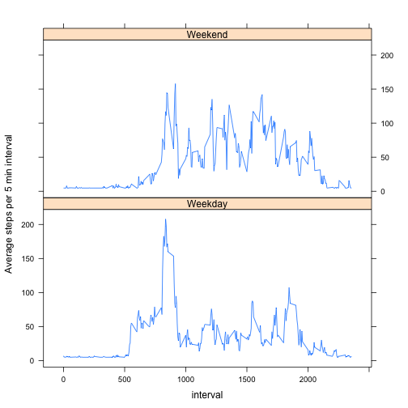

### Analysis of activity data

#### Introduction

This assignment uses data collected from a personal activity monitoring device. This device collects data at 5 minute intervals through out the day. The data consists of two months of data from an anonymous individual collected during the months of October and November, 2012 and include the number of steps taken in 5 minute intervals each day.

The data is from file 
[activity.zip](https://d396qusza40orc.cloudfront.net/repdata%2Fdata%2Factivity.zip)
    which was downloaded on 2015-01-17.
    
The variables included in this dataset are:  
-- steps: Number of steps taking in a 5-minute interval (missing values are
coded as NA)  
-- date: The date on which the measurement was taken in YYYY-MM-DD
format  
-- interval: Identifier for the 5-minute interval in which measurement was taken

The analysis is divided into the following steps:  
1. Loading of libraries and data  
2. Total number of steps per day  
3. Daily activity patterns  
4. Filling in missing values and repeating step 3  
5. Weekday/weekend specific activity patterns  

##### First we load the necessary libraries and the data

*Note:* rmd template and data file need to be located in the same (working) directory.


```r
library(stringr)
library(plyr)
library(timeDate)
library(lattice)
x <- read.csv(unz("activity.zip","activity.csv"),stringsAsFactors = FALSE)
summary(x)
```

```
##      steps            date              interval     
##  Min.   :  0.00   Length:17568       Min.   :   0.0  
##  1st Qu.:  0.00   Class :character   1st Qu.: 588.8  
##  Median :  0.00   Mode  :character   Median :1177.5  
##  Mean   : 37.38                      Mean   :1177.5  
##  3rd Qu.: 12.00                      3rd Qu.:1766.2  
##  Max.   :806.00                      Max.   :2355.0  
##  NA's   :2304
```

##### Next we calculate the total number of steps per day:


```r
stepsPerDay <- ddply(x, .(date), summarize, totSteps = sum(steps))
stepsPerDay$date <- strptime(stepsPerDay$date,"%Y-%m-%d")
with (stepsPerDay, {
        fromDate <- substr (min(date),1,10)
        toDate <- substr (min(date),1,10)
        hist(totSteps,
             ylab = "Frequency", xlab = "Number of steps per day",
             main = paste("Histogram of number of steps per day from\n", 
                          fromDate," to ",toDate))    
    }
)
```

 
  
For the number of steps per day we observe a **mean** value of 
10766.19 and a **median** of 10765.  
  
##### We then determine the average daily activity profile:


```r
x$interval <- str_pad(x$interval,4,pad="0")
avgStepsPerInterval <- ddply(x, .(interval), summarize, totSteps = mean(steps,na.rm=TRUE))

with (avgStepsPerInterval, {
    plot(interval,totSteps, type = "l", xlab = "5 min interval",
         ylab="Avg number of steps", 
         main = paste("Average number of steps per interval"))
    }   
)
```

 
  
The 5 minute interval with **highest number of average steps** is 
0835.  


##### Filling in missing values

The original dataset contains 2304 missing observations, i.e. time intervals without a report on the number of steps. 
We create a copy of the original dataset where we replace all missing values by the overall average number of steps (37.38) taken during a 5 minute interval.

```r
y<-x
y$steps[which(is.na(x$steps))] <- mean(x$steps,na.rm=TRUE)
summary(y)
```

```
##      steps            date             interval        
##  Min.   :  0.00   Length:17568       Length:17568      
##  1st Qu.:  0.00   Class :character   Class :character  
##  Median :  0.00   Mode  :character   Mode  :character  
##  Mean   : 37.38                                        
##  3rd Qu.: 37.38                                        
##  Max.   :806.00
```
 
  
The figures above show that the overall shape of the histogram has not changed significantly.  
Nor have mean and median of the steps taken per day:  
Mean:   10766.19 vs
10766.19  
Median: 10766.19 vs
10765.00.  
  
##### Weekday/weekend specific activity patterns

Finally we derive a modified dataset based on the dataset with missing observations filled in earlier. We add a factor indicating the type of day (weekday/weekend) for each observation and calculate the average steps per interval per type of day.


```r
y$date <- strptime(y$date,"%Y-%m-%d")
z<-data.frame(y,day= ifelse(isWeekday(y$date,wday=1:5),"Weekday","Weekend"))
z<-transform(z,interval=as.integer(interval))
avgStepsPerInterval <- ddply(z, .(interval, day), summarize, totSteps = mean(steps,na.rm=TRUE))

xyplot(totSteps ~ interval | day, data = avgStepsPerInterval, layout = c(1, 2), type = 'l', ylab = "Average steps per 5 min interval")
```

 
Comparing the two plots we note that the activity profile peaks later in the day on weekends and is more spread out than on weekdays.
